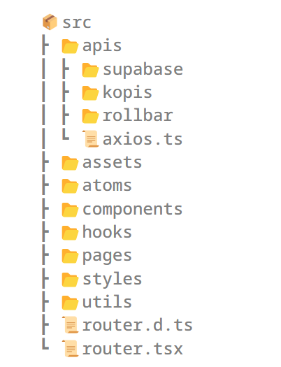
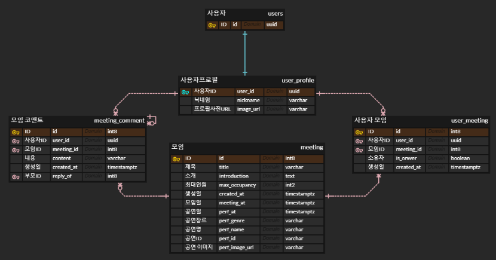

# Gonggam

### 프로젝트 개요

KOPIS에서 제공하는 API를 사용하여 공연 정보를 제공하고, 함께 공연을 볼 사람들을 모을 수 있는 커뮤니티 어플

- 🔗 안드로이드 다운: [앱스토어 링크]()
- 🔗 iOS 다운: 출시 예정
- 📅 개발 기간: 2024.04 ~ _current_

### 프로젝트 주제

공연 함께 보기, 공연 정보 안내, 공연 예매 안내 등을 통해 사용자들에게
편리한 공연 경험을 제공하고, 공연의 감동을 함께 나눌 수 있는 커뮤니티
 

### 프로젝트 선정배경

🤔 공연은 보고 싶은데 혼자 보기는 싫은데 어떻게하지?  
🤔 공연 예매 일정에 맞춰서 모임도 만들어 보고 싶다..? 
🤔 관심공연에 대해 의견 나눠보고 싶은데 어떻게 하지? 
 

### 👩‍💻 팀원 목록

<table>
   <tr>
    <td align="center"><b><a href="https://github.com/murramge">강은화</a></b></td>
    <td align="center"><b><a href="https://github.com/SSH8560">송승훈</a></b></td>
    <td align="center"><b><a href="https://github.com/newsks">신수경</a></b></td>
    <td align="center"><b><a href="https://github.com/espoiryoung">전진영</a></b></td>
  </tr>
  <tr>
  <td align="center"></td>
    <td align="center"></td>  
    <td align="center"></td>  
    <td align="center"></td>
  </tr>
  <tr>
    <td align="center"><b>Frontend</b></td>
    <td align="center"><b>Frontend</b></td>
    <td align="center"><b>Frontend</b></td>
    <td align="center"><b>Frontend</b></td>
  </tr>
</table>

 

# 시연 영상 🎥 
🔗 [시연영상](https://youtu.be/KYwfAjVl6mY)

 

## 폴더구조 📝

👋 폴더구조

 

## ERD 📊

 

## 팀 컨벤션 👭

### 💫 그냥 작성한 코드는 없다

내가 작성한 모든 코드에 대해 왜 그렇게 작성했는지 얘기할 수 있어야 한다.

### 💫 머지하는 순간 모두의 코드가 된다

남의 코드에서 오류가 발생했다면, 리뷰를 제대로 하지 않은 나의 책임도 있다.  
남의 코드에서 오류가 발생했다면, 함께 원인을 찾고 해결한다.

### 💫 남는 건 기록뿐이다

협업하며 발생한 모든 로그는 프로젝트 레포지토리 및 노션에 기록한다.

### 💫 사람은 실수하지만 테스트 코드는 실수하지 않는다

다양한 테스트를 추가해 서비스의 안정성을 최우선으로 생각한다.

